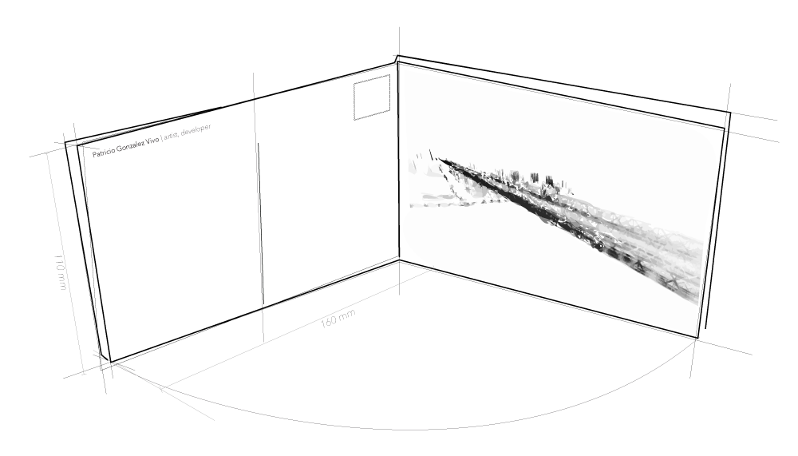

Are postcards revealing the invisible information of a city that is otherwise trapped inside corporate databases, freeing private information collected from public spaces.

# [SKYLINES](http://www.patriciogonzalezvivo.com/2014/skylines/)

This series of projects is about awareness. It is about the tools and techniques we use to see the world around us.

These projects were part of an ongoing [process](http://www.patriciogonzalezvivo.com/2014/skylines/process.php) of investigation during my last year as a Parson's MFA DT student and they are presented as three explorations around the theme of skylines.

We look at the horizon and see a _skyline_, the place where the earth and sky touch. This contour is the confluence of time and space. The landscape is in constant change and fluctuation; it is shaped over time by forces like erosion and human desire. This skyline is also defined by the particular position of the observer - seeing through technical devices allows us to look beyond our perception into different qualities of time and space.

[ [Read more about SKYLINES...] ](http://www.patriciogonzalezvivo.com/2014/skylines/)

